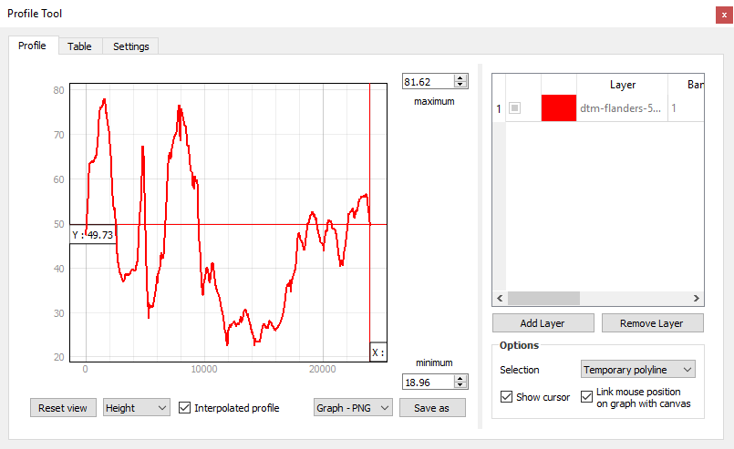

<a href="../index.html" class="btn btn-primary">Back to Home...</a>

# Table of contents

## Preliminary notes

- [Additional resources](add-resources.html)
- [Technical considerations](technical-considerations.html)

## Sessions

- [Session 1](session-1.html)
- [Session 2](session-2.html)
- [Session 3](session-3.html)

----

# Additional resources

## QGIS tips and hints

### Good practices

- Always save the outputs of toolboxes on the disk of your machine. Do **not** use temporary files.
- Always work with layers which have **the same projection**. QGIS efficiently deals with the EPSG codes, i.e. 4-5 digit numbers that represent coordinate reference system definitions. Also make sure that the data frame has the same projection than layers. EPSG codes are listed on the [epsg.io](https://epsg.io/) or [spatialreference.org](https://spatialreference.org/ref/epsg/) websites. For instance, the WGS84 is EPSG:4326, the Lambert 72 is EPSG:31370, and the UTM 31N is EPSG:32631. As in ArGIS, the data frame peojection is defined by the projection of the first layer imported in the project.
  - To reproject a shapefile: "Menu Vector > Data Management Tools > Reproject Layer".
  - To reproject a raster: "Menu Raster > Projections > Warp (Reproject)".
  - To define the data frame coordinate reference system: "Menu Project > Properties" > Tab "CRS".
- Avoid spaces and special characters in filenames.
- Use `.shp` for vector data and `.tif` for raster data. For raster data, it might also be `.sgrd` or `.sdat`, depending on the toolboxes that you run.

### Layer not rendering properly

Single-band raster datasets are usually rendered using a color ramp from black to white. In practice, it means that the range of values contained in the datasets is stretched over the black to white gradient. If the distribution of these values is not relatively constant over the entire range, e.g. the majority of values is less than 1000 while only a few pixels have very large values (e.g. > 10^6), the GIS will render a completely black layer. This might be caused by a mis-interpretation of no data values in digital elevation models. It is also typical for flow accumulation data (few large values in rivers while majority of hillslopes have low values).

To properly render such raster datasets, the idea is to ask QGIS to render values only on the currently visible range of pixel values. To do so:

1. Open the properties of the layer.
2. Open the "Symbology" tab.
3. In the "Min/Max Value Settings" section, define "Statistics Extent" as "Updated canvas" in the dropdown menu.


### Processing toolboxes

If the "Processing Toolbox" panel has disappeared, simply go to the "Menu Processing > Toolbox".

### Install plugins in QGIS

1. Go to menu "Plugins > Manage and install plugins".
2. Browse the plugins and install the ones needed, e.g. "Profile tools" or "Base layers".
    
3. Plugins are now accessible either in the menu "Plugins" or in the other menus, e.g. "Processing".

### Add base layers

You can add base layers, e.g. OpenStreetMap, using the plugin "QuickMapServices" plugin in QGIS.

1. Install the plugin via the Plugin Menu.
2. Activate base layers via the menu "Web > QuickMapServices".

### Add WMS layer

GIS resources may be stored on GIS servers. This is often the case in companies, public administrations,... where several people need to access up-to-date versions of spatial datasets. Such datasets can potentially be accessed using the Web Map Service (WMS) protocol by external users, directly in their local GIS software. To do that, you need the url of the WMS and, if applicable, the credentials.  

WMS adresses are usually stored in metadata of spatial datasets. For instance, wms of WalonMap data are accessible in the "Fiche descriptive > Accès" of each data.


Two lists of WMS in Belgium:

- The "institutional" repository: [https://www.geo.be/](https://www.geo.be/)
- A "unofficial" list: [https://wms.michelstuyts.be/](https://wms.michelstuyts.be/)

In practice, in QGIS, for the IGN cartoweb layer:

1. Menu "Layer" > "Add Layer" > "Add WMS/WMTS Layer"
2. Click "New" and enter these parameters.

    | Setting | Value                                                    |
    | ------- | -------------------------------------------------------- |
    | Name    | IGN                                                      |
    | URL     | [http://wms.ngi.be/inspire/topomaps/service?version=1.3.0](http://wms.ngi.be/inspire/topomaps/service?version=1.3.0) |

3. Click "OK".
4. Select the layer and click "Connect". A list of all available layers is provided in the table.
5. Choose which layer you want to add in your project and click "Add".

    

### Crop DEM

1. Open the DEM in QGIS.
2. Select the tool "Clip Raster by Extent" in the menu "Raster > Extraction".
3. Fill the toolbox. You can either define the extent interactively by drawing a rectangle in the dataframe or use a shapefile.
4. Export the result in the **.bil format**.

### Use Profile tool

1. In the table of contents of QGIS, select the DEM layer.
2. Open "Profile tool " via the menu "Plugins".
3. Click on the button "Add Layer", to define the DEM from which you will extract elevation.
4. In the "Options" panel, define "Selection" as "Temporary polyline".
5. Interactively draw a line on the DEM to define the extent of the topographic profile. You can also use polyline shapefiles.
    
6. Once the profile is ok, open the "Table" tab.
7. Click on "Copy to clipboard (with coordinates)".
8. Open Excel and paste the profile.
9. Headers of columns are: "Distance" / "Longitude" / "Latitude" / "Elevation".
10. You can now plot the profile directly within Excel, and eventually save the table.

### Add text-delimited layers

Based on a csv file containing coordinates, you can create a layer to be spatialised in QGIS, e.g. channel network outputs from LSDTopoTools.

1. Open the tool 'Add delimited text layer' in the menu "Layer > Add Layer".
2. Browse to find the csv file containing coordinates to be spatialised.
   1. Select **csv file format** just below where you select the file.
   2. You need to check on the **X Field** and **Y Field** entries to make sure that they are correct!
   3. Define the correct coordinate system, in which points are defined.
   4. Click on the button "Add".
   5. A temporary point layer is created. You need to save it to a permanent file if needed.


### Convert raster to vector

This tool is useful to create polygons defining the extent of river catchments, because LSDTopoTools provides a raster as output.
1. Open the "Polygonize" tool in the menu "Raster > Conversion".
2. Define which raster you need to process and run...

    

### Extract values of rasters to points

You can extract raster values at the location of points, defined by a shapefile. To do so, use the tool "Add raster values to poitns", available in the menu "Processing > Toolbox". Either search by name or find in the the toolbox structure: SAGA > Vector / Raster.


If the "Add raster values to points" does not work properly, an built-in QGIS alternative is the "Sample Raster Values".


-----

## OASIS shared drive

Instructions to connect to the OASIS shared drive from outside the UCL network are available [here](https://intranet.uclouvain.be/fr/myucl/services-informatiques/service-fichier-groupe.html). The adresse of the drive is: `\\oasis.uclouvain.be\dfs\groups\d\did-SST-Commun\LGEO2240`

-----

## MobaXterm tips and hints

- When you download files from the server (**do not "Drag and drop"**):
  1. Select them manually.
  2. Right-click and select "Download".
  3. Choose a directory.
- To paste a copied text line, simply right-click in the terminal window, where you would write the text line.
- To visualise or edit text files from the server:
  1. In the file browser of MobaXterm software, double-click on the file. It will be opened in Notepad.
  2. View and/or edit it.
  3. Save the file and select "Yes" when the following screen appears. It will upload the modified file directly on the server.


## LSDTopoTools tips

LSDTopotools requires DEM in `bil` format, projected in the UTM coordinate system. The easiest way to properly format files is using the following procedure.

```bash
# Project DEM into UTM projection
gdalwarp -t_srs '+proj=utm +zone=31 +datum=WGS84' -ot Int16 -of ENVI -dstnodata -9999 -tr 10 10 -r bilinear input_filename.tif output_filename.bil
# Convert the DEM into a ENVI BIL format
gdal_translate -of ENVI dem-input.tif dem-output.bil
```

More info [here](https://lsdtopotools.github.io/LSDTT_documentation/LSDTT_introduction_to_geospatial_data.html).

## OASIS server (not in 2020-2021)

All the data are stored on the OASIS shared drive from the university. In the computer rooms of the faculty, the path is; `Y:/SC/LGEO2240`.

Instructions to connect to the OASIS shared drive from outside the UCL network are available [here](https://intranet.uclouvain.be/fr/myucl/services-informatiques/service-fichier-groupe.html). The adresse of the drive is: `\\oasis.uclouvain.be\dfs\groups\d\did-SST-Commun\LGEO2240`
