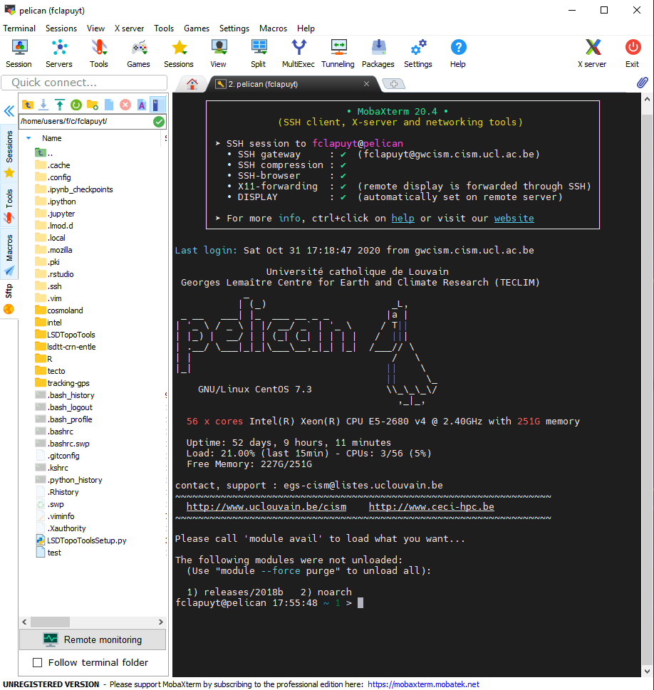

<a href="../index.html" class="btn btn-primary">Back to Home...</a>

# Table of contents

## Preliminary notes

- [Additional resources](add-resources.html)
- [Technical considerations](technical-considerations.html)

## Sessions

- [Session 1](session-1.html)
- [Session 2](session-2.html)
- [Session 3](session-3.html)

----

# Technical considerations

In order to perform efficient topographic analyses, we will use the LSDTopoTools software. Its use will require a small learning curve, but you will quickly see its benefits. If not, try to perform the same analysis over such large areas manually in ArcGIS or QGIS, as efficiently as in command line via the terminal using the LSDTopoTools software on a **server**...

## Server and SSH

### The client-server model and the Pelican server

The software is more efficiently and easier to use when deployed on a remote Linux server. A server is a piece of computer hardware that provides functionality for other programs or devices, called clients. This architecture is called the client–server model. Servers can provide various functionalities, often called "services", such as sharing data or resources among multiple clients, or performing computation for a client. A single server can serve multiple clients, and a single client can use multiple servers. Typical servers are database servers, file servers, mail servers, print servers, web servers, game servers, and application servers.

The server that we will use during the practical sessions is the "Pelican" server, which is part of the [CISM](https://uclouvain.be/en/research/cism) (Center for High Performance Computing and Mass Storage) of the UCLouvain. The Pelican server will allow you to run LSDTopotools, but also provides Nextcloud and JupyterHub services. [Nextcloud](https://nextcloud.com/) is an open-source file hosting service (similar to Dropbox, OneDrive,...). [JupyterHub](https://jupyter.org/hub) is an open-source web application that allows you to create and share documents that contain live code, equations, visualizations and narrative text.

### SSH protocol and client

The connection between the client (you) and the server is done via the internet, which is an open and unsecured network by definition. In order to access the server in a secure way, all the transactions between the client and the server are done using a cryptographic network protocol, i.e. the Secure Shell (SSH). SSH refers both to the cryptographic network protocol and to the suite of utilities that implement that protocol. SSH uses the client-server model, connecting a Secure Shell client application, which is the end where  the session is displayed, with an SSH server, which is the end where the session runs.

SSH clients are softwares which enable the user to connect to the server using the SSH protocol. Depending on the OS on which your machine is running, several SSH clients are possible.

- On Windows: [MobaXterm](https://mobaxterm.mobatek.net/).
- On Mac and Linux: [Termius](https://termius.com/) (also run on Windows but the free version has limited possibilities for file transfer).

-----

## CISM account

In order to connect to the server, a CISM account is required. To create one, you first need to be connected to the UCLouvain network, i.e. via the wireless network, a computer in a didactic room or via [UDS](https://uds.siws.ucl.ac.be/login/) (in this case, use Firefox and not Chrome).  

1. Visit the following web adress: [https://www.cism.ucl.ac.be/cilog](https://www.cism.ucl.ac.be/cilog)
2. Submit your **@student.uclouvain.be** email adress via the form.
3. Follow the link that you will nearly instantly receive by email.
4. Fill in the form with the following details:

    | Setting          | Value                                         |
    | ---------------- | --------------------------------------------- |
    | Supervisor email | *your teaching assistant @uclouvain.be email* |
    | Intended usage   | Interactive computing only                    |
    | Institution      | ELI > ELIC                                    |

5. Submit the form for validation by an administrator.

-----

## SSH clients

### On Windows

**Side note:** If you are working on a UCL desktop PC, simply open MobaXterm software (Search by name ou via "Menu Démarrer > Electricité")

To install MobaXterm on your machine, follow these steps:

1. Download MobaXterm **Portable Edition** software via this [link](https://mobaxterm.mobatek.net/download-home-edition.html). It is a portable terminal allowing you to easily connect to a remote server and transfer files from a local disk to the server, and vice-versa.
2. Extract it the zip file in a dedicated folder on your disk.
3. Run the `MobaXterm_Personal_20.4.exe` file.

If you are kind of a geek person, you will directly see that this software offers plenty of possibilities, e.g. SSH, FTP, VNC connections, X11 servers… However, we are here only interested in the SSH component.

### On Mac / Linux

To install Terminus on Mac or Linux, visit the download [page](https://github.com/Eugeny/terminus/releases/tag/v1.0.120) and download the file which suits your distribution. Install it as any other program under your OS

-----

## Connection to the Pelican server

### On Windows

To connect to Pelican via SSH, follow these steps:

1. Open the `MobaXterm_Personal_20.4.exe` file.

    

2. Go to the menu “Sessions > New Session”.
3. Select the “SSH” session and fill the "Basic SSH settings" as follows:

    | Setting          | Inside UCLouvain network | Outside UCLouvain network |
    | ---------------- | ------------------------ | ------------------------- |
    | Remote host      | pelican.cism.ucl.ac.be   | pelican                   |
    | Specify username | check                    | check                     |
    | Username         | *CISM_LOGIN*             | *CISM_LOGIN*              |

4. If your are **inside** the UCLouvain network, leave everything else as is, and click “OK”.

    

5. If you are **outside** the UCLouvain network, click on the "Network settings" tab and click on the "SSH gateway (jump host)" icon.

    

6. In this tab, fill the following parameters and click "OK" to close the window and click "OK" to validate the session:

    | Setting      | Outside UCLouvain network |
    | ------------ | ------------------------- |
    | Gateway host | gwcism.cism.ucl.ac.be     |
    | Username     | *CISM_LOGIN*              |

    

7. In order to open the session, MobaXterm first ask you the password for the gateway (`gwcism.cism.ucl.ac.be`) if you are outside the UCLouvain network:

    

8. And then prompt you the password for the Pelican server itself. Both passwords are the password of your CISM account. In a linux terminal, the cursor on screen will not move, and there is no indicator the password is being entered at all. This is intentional and serves as a security mechanism, unlike entering a password into a web form or a standard GUI login screen, which is typically masked as asterisks or bullets. The reason is rather simple, it provides no indication for how long a password is, offering some further obfuscation to password entry.

    

9. If your terminal display a lot of "strange" information, i.e. the server specifications, but also a **pelican drawing**, it means that you are now connected to the Pelican server. You can then interact with the server by typing your first command, e.g. `pwd`.

The MobaXterm window has two panels. The left (white) panel has several tabs in the vertical axis. The *SFTP* tab is the file browser on the server. It allows you to create files and folders on the server, as well as upload and download files from and to the server. The *Sessions* tab contains the different saved sessions. The right (black) panel is the terminal, which allows you to can interact with the server using command lines.

### On Mac / Linux

1. Open Terminus and select "Settings".

    

2. On the left panel, select "SSH" and then "Add connection".
3. Create a connection to the gateway using the following parameters:

    | Setting        | Value                 |
    | -------------- | --------------------- |
    | Name           | gateway               |
    | Group          | cism                  |
    | Host           | gwcism.cism.ucl.ac.be |
    | Port           | 22 (already there)    |
    | Username       | *MY_LOGIN* (CISM)     |
    | Authentication | Password              |

    

4. Click "Save".
5. Create a second connection to the Pelican server using the following parameters:

    | Setting        | Value                  |
    | -------------- | ---------------------- |
    | Name           | pelican                |
    | Group          | cism                   |
    | Host           | pelican.cism.ucl.ac.be |
    | Port           | 22 (already there)     |
    | Username       | *MY_LOGIN* (CISM)      |
    | Authentication | Password               |

6. In the "Advanced" tab, define the following parameters:

    | Setting          | Value               |
    | ---------------- | ------------------- |
    | Jump host        | gateway             |
    | Agent forwarding | Activate the slider |

    

7. Click "Save".

Now, the SSH connection (via the gateway) is set up and you can connect to the Pelican server. To do that:

1. Click on the "world" icon on the right side of the menu bar.
2. Select the "**cism / pelican**" connexion. **Not** the gateway.
3. Enter your CISM password two times, i.e. once for the gateway and once for the server itself.

-----

## Nextcloud

[Nextcloud](https://nextcloud.com/) is an open-source file hosting service (similar to Dropbox, OneDrive,...) and is available on the Pelican server with your CISM login and password, here: [https://nextcloud.cism.ucl.ac.be](https://nextcloud.cism.ucl.ac.be). You can install a desktop client via the website of Nextcloud.

During the practical sessions, Nextcloud can be used as a way to transfer files from your PC to the server and vice-versa. It will be used by Mac and Linux users. For those on Windows who are using MobaXterm, it is not a necessary step, as MobaXterm provides an integrated SFTP interface.

To connect an external storage, i.e. your home folder on the Pelican server, follow these steps:

1. Go to the settings of Nextcloud via the web interface, i.e. click on the icon on the upper-right corner of the screen (with the first letter of your firstname) and choose "Settings".

    

2. Choose "External storages" on the left panel.
3. Add a new external storage using the following settings:

    | Setting        | Value                  |
    | -------------- | ---------------------- |
    | Folder name    | Pelican                |
    | Add storage    | SFTP                   |
    | Authentication | Username and password  |
    | Host           | pelican.cism.ucl.ac.be |
    | Root           | /home/elic/*MY_LOGIN*  |
    | Username       | *MY_LOGIN* (CISM)      |
    | Password       | *MY_PASSWORD* (CISM)   |

4. Click on the "v". If the settings are correct, the icon on the left should be green.

    

5. Files on folders on the Pelican servers are now accessible in your folder structure in the home page of the Nextcloud web interface.
