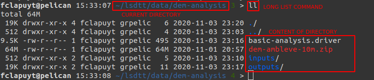

## Intro to the shell

- A very short intro on the Linux terminal [here](https://www.digitalocean.com/community/tutorials/an-introduction-to-the-linux-terminal).
- A longer intro on the Linux terminal [here](https://ryanstutorials.net/linuxtutorial/).

### Basic shell commands

| Command                                               | Use                                   |
| ----------------------------------------------------- | ------------------------------------- |
| pwd                                                   | Print current (working directory)     |
| ls *my_directory*                                     | List files in a directory             |
| cd *my_path*                                          | Define (go to) current directory      |
| cd                                                    | Return to `HOME` directory            |
| cd ../                                                | Go to parent directory                |
| rm *my_file*                                          | Remove file (**!no way back!**)       |
| mkdir *my_directory*                                  | Create directory                      |
| rmdir -rf *my_directory*                              | Remove directory (**!no way back!**)  |
| cp *path_to_source* *path_to_destination*             | Copy file or directory                |
| mv *path_to_source* *path_to_destination*             | Move file or directory                |
| `Ctrl-Shift-C`                                        | Copy some text in vim editor          |
| `Ctrl-Shift-V`                                        | Paste some text in vim editor         |
| vim *path_to_text_file*                               | Open text file using `vim`            |
| unzip *path_to_archive_file* -d *path_to_destination* | Unzip a `.zip` archive in a directory |
| `Ctrl-C`                                              | Cancel current command                |

### Good practices

Working on the terminal can difficult in the beginning. One difficulty is to always know where you are located in the file tree.

- Use `pwd` command to print the current directory.
- Use `ls` (list) or `ll` (long list) commands to print the content of the current directory. Use it *often*... Typically after a command that create outputs, to check whether they are created...

    

- Use `Tab` key to auto-complete file names and directory names. Hit `Tab` key again to get a list of possibilities, if there are several ones.
- Use `Up ` and `Down` arrows of the keyboard to navigate in the history of commands that you already executed.

### Paths (examples on the Pelican server)

Some facts about paths to directories and files:

- When you connect to the Pelican server, you land in your `HOME` directory.
- The absolute path of your `HOME` directory is: `/home/elic/MY_LOGIN`.
- Anywhere in the file tree, execute the `cd` command to return the `HOME` directory.
- Absolute paths are always written with respect to the `root` of the file tree, i.e. `/`.
- A typical absolute path to the DEM file would be: `/home/elic/MY_LOGIN/lsdtt/data/dem-analysis/mnt-ambleve-10m.tif`.  Notice the `/` at the beginning of the path, indicating that it is an absolute path, i.e. starting from the `root`.
- A typical relative path to the DEM file,  if you are located in your `HOME` directory: `lsdtt/data/dem-analysis/mnt-ambleve-10m.tif`. Note that there is no `/` at the beginning of the path.
- Relative paths are always expressed relatively to the current directory.
- To know the current directory, use the `pwd` command (print working directory).

### Sequence of example commands 

Type and execute the following sequence of commands to learn how to communicate with the server: 

```bash
# Print working directory
pwd
# List files in current directory
ls
# create new directory
mkdir dem-analysis
# create file in dem-analysis directory
vim dem-analysis/params.txt
# type i to activate insert mode, write something, hit Esc to quit edit mode, type ":wq" to write and quit the file
# List files in dem-analysis directory
ls dem-analysis
# Enter dem-analysis directory
cd dem-analysis
# List files in current direct
ls
# List files in parent directory
ls ../
# Create new directory in current directory
mkdir outputs
# list files in current directory
ls
# Copy params.txt into outputs directory with a new name
cp params.txt outputs/params-v2.txt
# Return to HOME directory
cd
# Enter outputs directory
cd dem-analysis/outputs
# Modify params-v2.txt file. Use "Ctrl-Shift-C" to copy and "Ctrl-Shift-V" to paste text.
vim params-v2.txt
# Print working directory
pwd
# Return to dem-analysis directory. The ~ is a way to create a path from the HOME directory. Useful when your are "lost" in the file structure.
cd ~/dem-analysis
# Copy outputs as a new directory. The "-r" parameter is for "recursive", i.e. it will copy all subdirectories too.
cp -r outputs outputs-v2
# List files in current directory
ls
# Delete outputs/params.txt
rm outputs/params-v2.txt
# Delete params.txt in current directory. The "-f" parameter is for "force".  
rm -f params.txt
# Delete outputs-v2.
rm outputs-v2
# To delete non-empty directories, do not forget the "-rf" parameters
rm -rf outputs-v2
# List files in current directory
ls
# Return to HOME directory
cd
# Delete dem-analysis directory
rm -rf dem-analysis
```

