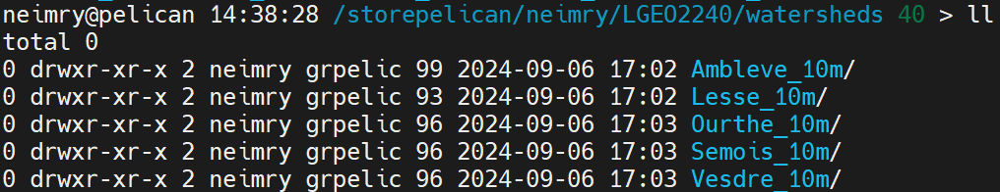

# First topographic analysis using LSDTT

## Directory structure

### Typical setup

1.  In the `lsdtt/data` directory, create a new directory for your analyses, e.g. named `dem-analysis`, and enter it:

    ``` bash
    cd
    cd lsdtt/data

    mkdir dem-analysis
    cd dem-analysis
    ```

2.  All the guidelines are based on this specific directory structure.

------------------------------------------------------------------------

## Get the DEM of your study area

**IMPORTANT:** From now, all parameters in UPPERCASE need to be adjusted according to your study area / login / directory structure...

<!-- The DEM of your study are is stored as an archive file `.zip` in the `/storepelican/fclapuyt/LGEO2240-DEM/` directory. -->

The DEM of your study are is stored in the \`/storepelican/neimry/LGEO2240/watersheds/ directory.



<!-- The aim is to copy the `.zip` directory of your study area into the `lsdtt/data/dem-analysis` directory, and unzip it into the `inputs` directory. To do so, execute the following sequence of commands: -->

The aim is to copy the directory of your study area into the `lsdtt/data/dem-analysis` directory. To do so, execute the following sequence of commands:

``` bash
# Set the current directory as lsdtt/data/dem-analysis
cd
cd lsdtt/data/dem-analysis

# List files in the repository of the practical sessions
ls /storepelican/neimry/LGEO2240/watersheds/

# Copy your file into the current directory
cp -rf /storepelican/neimry/LGEO2240/watersheds/NAME_OF_STUDY_AREA/* .

# Check that files are properly stored in the current directory
ls
```

## A first topographic analysis of your study area

1.  Create a parameters file in the `dem-analysis` directory:

    ``` bash
    cd
    cd lsdtt/data/dem-analysis
    vim basic-analysis.driver
    ```

2.  Paste the following content that might be something plausible for your study area. Adapt the parameters to your needs, e.g. the name of the input name and output prefix, minimum and maximum basin sizes, river threshold for contributing pixels.

    ``` bash
    # Parameters for extracting simple surface metrics
    # Comments are preceeded by the hash symbol
    # Documentation can be found at: https://lsdtopotools.github.io/LSDTT_documentation/LSDTT_basic_usage.html

    # These are parameters for the file i/o
    # read fname and write fname should be the same, if you want to visualise your outputs
    # using LSDMappingTools...
    read fname: PREFIX_OF_INPUTS_FILE
    write fname: PREFIX_OF_OUTPUTS_FILE
    channel heads fname: NULL

    # Compute filled DEM
    print_fill_raster: true

    # Compute longitudinal distance from outlets
    print_distance_from_outlet: true

    # Compute D8 drainage area
    print_d8_drainage_area_raster: true

    # Parameters for surface metrics
    surface_fitting_radius: 50

    # Compute surface metrics
    print_slope: true
    print_aspect: true
    print_curvature: true
    write_hillshade: true

    # Compute basic channel network
    threshold_contributing_pixels: 1000
    print_junctions_to_csv: true
    print_channels_to_csv: true
    print_sources_to_csv: true

    # Compute basic chi metrics
    print_chi_data_maps: true

    # Parameters for basin creation
    find_basins: true
    minimum_basin_size_pixels: 10000
    maximum_basin_size_pixels: 1000000

    # Create the basin raster
    print_basin_raster: true
    ```

3.  Run the `lsdtt-basic-metric` module on the created parameter file:

    ``` bash
    lsdtt-basic-metrics basic-analysis.driver
    ```

4.  It will take some time to run. But you will quickly see that it runs very fast in comparison to QGIS given the amount of pixels to process and outputs created. Many outputs are created (!): filled, dem, slope, aspect, curvature and tangential curvature, hillshade, river network, chi metrics, flow distance... From here, you will begin to understand that learning all the shell / server / LSDTopoTools stuff could really worth it... :-)

> For easier use with LSDMappingTools, **you should use the input DEM name as `write fname` parameter, i.e. `read fname` and `write fname` should have the same value.**

## Data visualisation on the server

The LSDMappingTools module enables to visualise data without downloading the data on your local drive and open them in QGIS. Once you have created your outputs, you can plot the DEM with the superimposed basins with the `PlotBasicRaster.py` tool:

``` bash
python ~/lsdtt/LSDMappingTools/PlotBasicRasters.py -dir ./ -fname PREFIX_OF_OUTPUTS_FILE -drape_fname PREFIX_OF_OUTPUTS_FILE -PD True -PB True -dpi 300
```

Outputs of LSDMappingTools are created in a new directory `raster_plots` that is created in the `dem-analysis` directory. To visualise them:

``` bash
# List files in the raster_plots directory
ls raster_plots
# Display the output you want...
display raster_plots/PREFIX_OF_OUTPUTS_FILE_basins_selected_basins.png
```

If you want to custom your plots, you just need to add a few parameters to the command (see the [documentation](https://lsdtopotools.github.io/LSDTT_documentation/LSDTT_visualisation.html) for the possibilities).

## Manage outputs of successive analyses

In order to keep track of all your analyses, you could, *for instance*, duplicate the `dem-analysis` directory for each new analysis, rename the old one and empty the *main* `dem-analysis` directory. This could be done using the following sequence of commands:

``` bash
# Enter data directory
cd
cd lsdtt/data

# Copy dem-analysis directory as dem-analysis-v1 (name to be adapted to your needs)
cp -r dem-analysis dem-analysis-v1
```

Finally, remove outputs in `dem-analysis` directory. Outputs are named as follows `PREFIX_TYPE-OF-OUTPUTS.EXT`, e.g. `dem-ambleve-10m_SLOPE.tif`, `dem-ambleve-10m_TAN.tif` or `dem-ambleve-10m_SLOPE.tif`. To remove all outputs in one command, use the asterisk `*` to select all files that begin with `PREFIX_OF_OUTPUTS_FILE_`. Do not forget the last '`_`' after the prefix, otherwise the DEM will also be deleted.

``` bash
rm -f dem-analysis/PREFIX_OF_OUTPUTS_FILE_*
```

## Data transfer

Data transfer can be done in the two *directions*, i.e. download data from the server to your local drive (outputs) and upload data from your local drive to the server (i.e. parameters files, river junctions,..).

### On Windows

In the MobaXterm interface, you can simply download and upload files using the file browser on the left panel. Use the buttons on the top of the file browser or right-click on files and directories.


### On Mac / Linux / Windows

There is no GUI for file transfer in Terminus. Instead, you have two possibilities:

-   Use [Nextcloud](https://nextcloud.cism.ucl.ac.be) with a mounted external storage. See the document `1_Technical_resources` for more info.

-   Use a local session of the terminal (using the `+` in the Menu bar) to execute this type of commands:

    ``` bash
    scp -r -oProxyCommand="ssh -W %h:%p MY_LOGIN@gwcism.cism.ucl.ac.be" MY_LOGIN@pelican.cism.ucl.ac.be:PATH_TO_FOLDER_ON_THE_SERVER/* PATH_TO_FOLDER_ON_LOCAL_MACHINE
    ```


------------------------------------------------------------------------

# Important note !

Each time you connect to the server, you will need to load LSDTopoTools before running the first command. Simply type:

``` bash
load_LSDTopoTools
```

------------------------------------------------------------------------