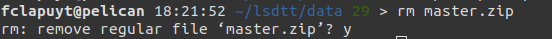

# The LSDTopoTools software

The LSDTopoTools software was developed by members of the Land Surface Dynamics (LSD) research group at the University of Edinburgh ([home page](https://lsdtopotools.github.io/)).

The software aims to operate:

- As a framework for implementing the latest developments in topographic analysis.
- As a framework for developing new topographic analysis techniques.
- As a framework for numerical modelling of landscapes.
- To improve the speed and performance of topographic analysis versus other tools (e.g., commercial GIS software).
- To enable **reproducible** topographic analysis in the research context.

This software is constantly used for research and is regularly updated with new routines. Some popular techniques already implemented include:

- [Basic topographic analysis](https://github.com/LSDtopotools/LSDTopoTools_AnalysisDriver)
- [Channel network extraction from LiDAR data](https://github.com/LSDtopotools/LSDTopoTools_ChannelExtraction)
- [Chi analysis](https://github.com/LSDtopotools/LSDTopoTools_ChiMudd2014)
- [Calculation of erosion rates from cosmogenic nuclides](https://github.com/LSDtopotools/LSDTopoTools_CRNBasinwide)
- [Hilltop flow routing, and hillslope relief metrics](https://github.com/LSDtopotools/LSDTT_Hillslope_Analysis)
- [Topographic extraction of floodplains and terraces](https://github.com/LSDtopotools/LSDTopoTools_FloodplainTerraceExtraction)

## Installation of LSDTopoTools

Using your SSH client, connect to the Pelican server.

1. Load the required modules:

    ```bash
    module purge
    module load 2019b
    module load ELIC_Python
    module load CMake/.3.15.3-GCCcore-8.3.0
    ```
2. Return to (make sure your are in the) `HOME` directory:

    ```bash
    cd
    ```

3. Create `lsdtt` directory and enter it:

    ```bash
    mkdir lsdtt
    cd lsdtt
    ```
4. Clone the Github repository:

    ```bash
    git clone https://github.com/LSDtopotools/LSDTopoTools2
    ```
5. Go to `src` directory:

    ```bash
    cd LSDTopoTools2/src
    ```
6. Open the `build.sh` file:

    ```bash
    vim build.sh
    ```

7. Hit `i` on your keyboard to insert text.
8. Move within the file content using arrows of your keyboard to place the cursor at the beginning of the file.
9. Add the following line at the **beginning** (first line) of file.  In vim editor, use `Ctrl-Shift-V` to paste some text (to copy, use `Ctrl-Shift-C`.

    ```bash
    PREFIX="$(pwd)/.."
    ```
10. Hit `Esc` on your keyboard to exit the *insert* mode.
11. Type `:wq` to *write* and *quit* the text editor.
12. Compile the driver files:

    ```bash
    sh build.sh
    ```
It will take some time...

## Installation of LSDMappingTools

The [LSDMappingTools](https://lsdtopotools.github.io/LSDTT_documentation/LSDTT_visualisation.html) module is a LSDTopoTools component to map outputs using automatic procedures. It will be useful to produce intermediate data visualisation to check results directly on the server.

To install it, execute the following sequence of commands:

```bash
# Enter lsdtt directory
cd
cd lsdtt

# Clone LSDMappingTools Github repository
git clone https://github.com/LSDtopotools/LSDMappingTools.git
```

## Add LSDTT variables to PATH

1. Open the `.bashrc` file in your `HOME` directory using the `vim` command.

    ```bash
    cd
    vim .bashrc
    ```

2. Hit `i` on your keyboard to insert text.
3. Move within the file content using arrows of your keyboard to place the cursor at the end of the file. **Note**: The file might be empty. It is a configuration file to set up your environment at the beginning of each session. Its content depends on the server raw setup.
4. Add the following lines at the end of file. Use `Ctrl-Shift-V` to paste some text (to copy, use `Ctrl-Shift-C`).

    ```bash
    load_LSDTopoTools()
    {
      module purge
      module load 2019b
      module load ELIC_Python
      PATH=${HOME}/lsdtt/LSDTopoTools2/bin:${PATH}
      PYTHONPATH=${HOME}/lsdtt/LSDMappingTools:${PYTHONPATH}
    }
    ```

3. Hit `Esc` on your keyboard to exit the *insert* mode.
4. Type `:wq` to *write* and *quit* the text editor.
5. Reload the `.bashrc` file.

    ```bash
    source .bashrc
    ```

## Get the example data

1. To download the example data, execute the following lines. Return to `HOME` directory and enter the `lsdtt` directory:

    ```bash
    cd
    cd lsdtt
    ```

2. Create the `data` directory:

    ```bash
    mkdir data
    cd data
    ```

3. Download data from Github repository, unzip and remove archive file:

    ```bash
    wget https://github.com/LSDtopotools/ExampleTopoDatasets/archive/master.zip
    unzip master.zip
    mv ./ExampleTopoDatasets-master ./ExampleTopoDatasets
    rm master.zip
    ```

4. When removing a file or a directory, the terminal will prompt you whether you really want to remove it:

    

5. Type `y` to confirm (yes) or `n` to abort (no).

## Directory structure

After installing the software and getting the example data, you should end up with the following directory structure (this is not the output of a specific command):

```
--| lsdtt
------| data
----------| subdirectories with different projects
------| LSDMappingTools
----------| subdirectories with source code and programs
------| LSDTopoTools2
----------| subdirectories with source code and programs
```

# Basic example using LSDTT

Before running your own analyses, it is important to make sure that the program is properly installed and set up on the server. Let's begin by running LSDTT with the provided example data. More information about the basic usage of LSDTT is available [here](https://lsdtopotools.github.io/LSDTT_documentation/LSDTT_basic_usage.html).

1. At the beginning of each new session on the server, you should load the LSDTT *environment*, i.e. load modules and add LSDTT to PATH. To to that, simply (because the function is stored in your `.bashrc` file, see "Add LSDTT variables to PATH") type:

    ```bash
    load_LSDTopoTools
    ```

2. Navigate to the directory containing the example data:

    ```bash
    cd
    cd lsdtt/data/ExampleTopoDatasets/BasicMetricsData
    ```

3. If you have correctly installed `LSDTopoTools`, you should be able to simply call `lsdtt-basic-metrics` command:
    ```console
    lsdtt-basic-metrics WA_BasicMetrics02.driver
    ```
4. Press "Enter" and wait... The larger the area and/or the finer the resolution, the longer it will last... However, some messages are printed in the terminal. Read them, especially if the tool crashes !

# How does LSDTT work ?

**Note**: This section provides additional information about how LSDTT works. There is no need to run the commands or modify parameters files.

Starting from the basic example here above (all details [here](https://lsdtopotools.github.io/LSDTT_documentation/LSDTT_basic_usage.html)), the typical command of LSDTopoTools is composed of two parts:

```bash
lsdtt-basic-metrics WA_BasicMetrics02.driver
```

- `lsddtt-basic-metrics` is the name of the module of LSDTopoTools that you ask to run.
- `WA_BasicMetrics02.driver` is the name of the file containing the input parameters used by the module. The extension of the file is `.driver`.

Without any other parameters, you need to run the command in the directory that contains the parameters file.

Open the `WA_BasicMetrics02.driver` file using the following commands:

```bash
# Make sure you are in the proper directory. If not, execute the commented line below.
# cd lsdtt/data/ExampleTopoDatasets/BasicMetricsData
# Open the file
vim WA_BasicMetrics02.driver
```

The content of the `WA_BasicMetrics02.driver` file is the following:

```bash
# Parameters for extracting simple surface metrics
# Comments are preceeded by the hash symbol
# Documentation can be found at: https://lsdtopotools.github.io/LSDTT_documentation/LSDTT_basic_usage.html

# These are parameters for the file i/o
read fname: WA
write fname: WA_SecondExample
channel heads fname: NULL

# Parameters for surface metrics
surface_fitting_radius: 11
print_slope: true
print_aspect: true
print_curvature: true
print_tangential_curvature: true

```

In this example with such parameters, it is assumed that:

- Lines beginning with the `#` symbol are comments. They will not be taken into account by the software.
- Input DEM and parameters file should be located in the directory in which you run the command.
- Outputs will be created in the same current directory.
- `WA` is the name of the DEM, without the `.bil` extension.
- The outputs will have a prefix as `WA_SecondExample`.
- Four outputs are created, using a given surface fitting radius: slope, aspect, curvature and tangential curvature.

Parameters documentation can be found [here](https://lsdtopotools.github.io/LSDTT_documentation/LSDTT_basic_usage.html#_analysis_options_for_the_lsdtt_basic_metrics_program).

## Parameters file

Parameters files are named as follows: `MyParametersFile.driver`. They always have the same structure. These files can be created or modified using e.g. Notepad or directly via the terminal using `vim`. In Notepad, save them as txt files but write the `.driver` extension in the filename.

```bash
# These are parameters for the file i/o
# IMPORTANT: You MUST make the write directory: the code will not work if it doesn't exist.
read fname: mnt-vesdre
write fname: mnt-vesdre
channel heads fname: NULL

# Definition of the parameters to run a given script
parameter_name: parameter_value
...
...
```

- `read fname` and `write fname` are usually the same. They define the prefix for inputs and outputs, i.e. the name of the input DEM, without the file extension.
- Inputs and outputs are stored in the same directory. This is required for data visualisation with LSDMappingTools.
- The parameters file should be located in the same directory as the inputs.

# Which topographic metrics are available in LSDTopoTools ?

Three modules of LSDTopoTools are useful for the analyses to achieve in the frame of the research project:

- The basic analysis ([resources](https://lsdtopotools.github.io/LSDTT_documentation/LSDTT_basic_usage.html)): `lsdtt-basic-metrics`
- The channel extraction ([resources](https://lsdtopotools.github.io/LSDTT_documentation/LSDTT_channel_extraction.html)): `lsdtt-channel-extraction`.
- The Chi analysis ([resources](https://lsdtopotools.github.io/LSDTT_documentation/LSDTT_chi_analysis.html); [related paper](https://esurf.copernicus.org/articles/6/505/2018/)): `lsdtt-chi-mapping`.

The manual for each module contains a lot of information... Focus *mainly* on "Appendix A" of each manual, which contains the parameters that are available, their explanation, and their potential to fulfill your needs. Each module works with a parameters file that has the same structure than the one you used for the first analysis of your study area. You *only* need to add or remove parameters in the fill and run it with the proper command.
