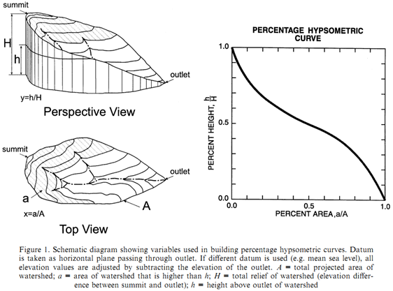

# Random topics

## Average using a moving window

Topographic data, as many other types of data, are noisy due to DEM creation and subsequent topographic derivatives. Therefore, it is often a good idea to smooth variables by averaging them using a moving window. The principle is very simple: replace a data point with the average of its neighbours, i.e. a window around the point ([source](http://www.statistics4u.info/fundstat_eng/cc_moving_average.html)).

*

The implementation of a moving window can simply be done either in Excel, R... In R, the suitable function is the `rollmean()` function from the `zoo` package ([resource](https://www.rdocumentation.org/packages/zoo/versions/1.8-8/topics/rollmean)). 

For topographic analyses, smoothing data is typically achieved on slope for Slope-Area graphs and on stream power index along the river longitudinal distance. 

## Concavity and channel steepness indices

Some resources to better understand the theory about concavity, channel steepness and chi metrics:

- For a very brief overview, refer to the intro of the Chi module of LSDTopoTools: [Link](https://lsdtopotools.github.io/LSDTT_documentation/LSDTT_chi_analysis.html).
- The purpose of Chi plots, i.e. computing Chi instead of slope: [Perron and Royden (2013)](http://web.mit.edu/perron/www/files/PerronRoyden13.pdf).
- The two research papers behind the module of LSDTopoTools: [Mudd et al. (2014)](https://agupubs.onlinelibrary.wiley.com/doi/full/10.1002/2013JF002981) and [Mudd et al. (2018)](https://esurf.copernicus.org/articles/6/505/2018/esurf-6-505-2018.pdf).

## Hypsometric curves

Following Strahler (1952), the hypsometric curve relates horizontal cross-sectional area of a drainage basin to relative elevation above basin mouth. As both parameters (in x and y) are dimensionless, curves can be described and compared irrespective of basin size or shape. In other words, it describes the relative proportion of the watershed area that lies at or above a given height relative to the total relief of the watershed (Luo, 1998). Differences in the shape of the curve are related to the degree of disequilibrium in the balance of erosive and tectonic forces (Weissel and Pratson, 1994).

**References**

- Luo, W. (1998). Hypsometric analysis with a geographic information system. *Computers & Geosciences*, *24*(8), 815-821.
- Strahler, A.N. (1952). Hypsometric (area-altitude) analysis of erosional topography. Geological Society of America Bulletin, 63, 1117-1142.
- Weissel, J.K., Pratson, L.F. (1994). The length-scaling properties of topography. Journal of Geophysical Research, 99, 13997-14012.

### To compute hypsometric curves in QGIS

In QGIS, use the *Hypsometric curves* toolbox available in the QGIS processing tools "Raster terrain analysis" (<u>not</u> "Hypsometry" from SAGA GIS).

1. Define the digital elevation model.
2. Define the "Boundary layer" parameter. It defines the limits of the river catchment of interest. It can be either a single polygon shapefile or a selected polygon in a multi-polygon shapefile. You can also loop on all the polygons of one given shapefile.
3. Importantly, define the "step" parameter. It defines the increment for the elevation, from the lowest to the highest point of the river catchment.
4. You can also consider to check the box "Use % of are instead of absolute value", in order to have a relative hypsometric curve and to allow comparison between catchments.

    

The output is a ``csv `` file, which contains the binned values for relative **downslope** catchment area and **absolute** elevation. You will therefore need to post-process the values to plot correct hypsometric curves.

- Relative height is computed by normalising height over its range, i.e. *[(z - z_{min}) / (z_{max} - z_{min}) ] \* 100*
  
- Relative **upslope** area is computed as follows: *100 - downslope area*

Visually, you should end up with something like: 

Here is the example file: [link](files/hypsometric-curves.ods)

## Use Profile tool

1. In the table of contents of QGIS, select the DEM layer.
2. Open "Profile tool " via the menu "Plugins".
3. Click on the button "Add Layer", to define the DEM from which you will extract elevation.
4. In the "Options" panel, define "Selection" as "Temporary polyline".
5. Interactively draw a line on the DEM to define the extent of the topographic profile. You can also use polyline shapefiles.
   
6. Once the profile is ok, open the "Table" tab.
7. Click on "Copy to clipboard (with coordinates)".
8. Open Excel and paste the profile.
9. Headers of columns are: "Distance" / "Longitude" / "Latitude" / "Elevation".
10. You can now plot the profile directly in Excel, and eventually save the table for further processing.
