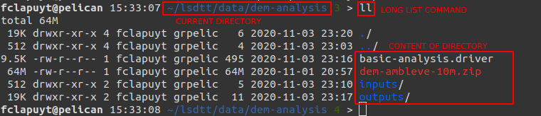
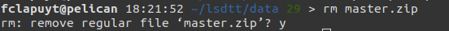
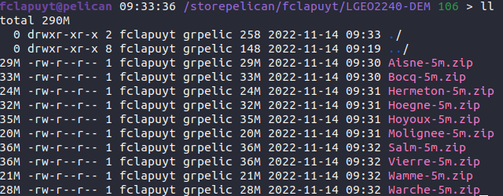
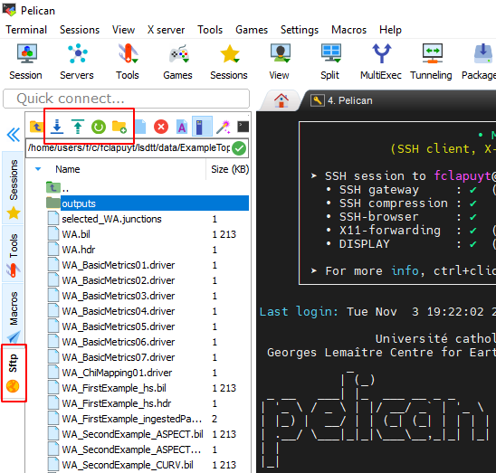
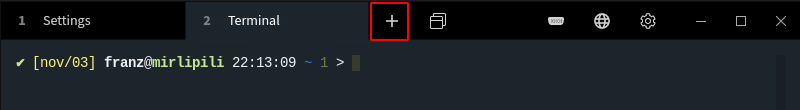

<!-- ---
layout: default
title: Session 2
permalink: /tecto/session-2
--- -->

# Session 2 - Intro to shell and LSDTopoTools

## Objectives of the day

1. Communicate with the server ::: Learn the basics of the shell usage.
2. Have a working infrastructure ::: Install LSDTopoTools.
3. Learn the logic of LSDTopoTools ::: Run an basic analysis on example data.
4. Compute the river network of your study area ::: Create a proper parameter file that suits your needs.

-----

## Intro to the shell

- A very short intro on the Linux terminal [here](https://www.digitalocean.com/community/tutorials/an-introduction-to-the-linux-terminal).
- A longer intro on the Linux terminal [here](https://ryanstutorials.net/linuxtutorial/).

### Basic shell commands

| Command                                               | Use                                   |
| ----------------------------------------------------- | ------------------------------------- |
| pwd                                                   | Print current (working directory)     |
| ls *my_directory*                                     | List files in a directory             |
| cd *my_path*                                          | Define (go to) current directory      |
| cd                                                    | Return to `HOME` directory            |
| cd ../                                                | Go to parent directory                |
| rm *my_file*                                          | Remove file (**!no way back!**)       |
| mkdir *my_directory*                                  | Create directory                      |
| rmdir -rf *my_directory*                              | Remove directory (**!no way back!**)  |
| cp *path_to_source* *path_to_destination*             | Copy file or directory                |
| mv *path_to_source* *path_to_destination*             | Move file or directory                |
| `Ctrl-Shift-C`                                        | Copy some text in vim editor          |
| `Ctrl-Shift-V`                                        | Paste some text in vim editor         |
| vim *path_to_text_file*                               | Open text file using `vim`            |
| unzip *path_to_archive_file* -d *path_to_destination* | Unzip a `.zip` archive in a directory |
| `Ctrl-C`                                              | Cancel current command                |

### Good practices

Working on the terminal can difficult in the beginning. One difficulty is to always know where you are located in the file tree.

- Use `pwd` command to print the current directory.
- Use `ls` (list) or `ll` (long list) commands to print the content of the current directory. Use it *often*... Typically after a command that create outputs, to check whether they are created...

    

- Use `Tab` key to auto-complete file names and directory names. Hit `Tab` key again to get a list of possibilities, if there are several ones.
- Use `Up ` and `Down` arrows of the keyboard to navigate in the history of commands that you already executed.

### Paths (on the Pelican server)

Some facts about paths to directories and files:

- When you connect to the Pelican server, you land in your `HOME` directory.
- The absolute path of your `HOME` directory is: `/home/elic/MY_LOGIN`.
- Anywhere in the file tree, execute the `cd` command to return the `HOME` directory.
- Absolute paths are always written with respect to the `root` of the file tree, i.e. `/`.
- A typical absolute path to the DEM file would be: `/home/elic/MY_LOGIN/lsdtt/data/dem-analysis/mnt-ambleve-10m.tif`.  Notice the `/` at the beginning of the path, indicating that it is an absolute path, i.e. starting from the `root`.
- A typical relative path to the DEM file,  if you are located in your `HOME` directory: `lsdtt/data/dem-analysis/mnt-ambleve-10m.tif`. Note that there is no `/` at the beginning of the path.
- Relative paths are always expressed relatively to the current directory.
- To know the current directory, use the `pwd` command (print working directory).

### Sequence of commands in the "demo"

```bash
# Print working directory
pwd
# List files in current directory
ls
# create new directory
mkdir dem-analysis
# create file in dem-analysis directory
vim dem-analysis/params.txt
# type i to activate insert mode, write something, hit Esc to quit edit mode, type ":wq" to write and quit the file
# List files in dem-analysis directory
ls dem-analysis
# Enter dem-analysis directory
cd dem-analysis
# List files in current direct
ls
# List files in parent directory
ls ../
# Create new directory in current directory
mkdir outputs
# list files in current directory
ls
# Copy params.txt into outputs directory with a new name
cp params.txt outputs/params-v2.txt
# Return to HOME directory
cd
# Enter outputs directory
cd dem-analysis/outputs
# Modify params-v2.txt file. Use "Ctrl-Shift-C" to copy and "Ctrl-Shift-V" to paste text.
vim params-v2.txt
# Print working directory
pwd
# Return to dem-analysis directory. The ~ is a way to create a path from the HOME directory. Useful when your are "lost" in the file structure.
cd ~/dem-analysis
# Copy outputs as a new directory. The "-r" parameter is for "recursive", i.e. it will copy all subdirectories too.
cp -r outputs outputs-v2
# List files in current directory
ls
# Delete outputs/params.txt
rm outputs/params-v2.txt
# Delete params.txt in current directory. The "-f" parameter is for "force".  
rm -f params.txt
# Delete outputs-v2.
rm outputs-v2
# To delete non-empty directories, do not forget the "-rf" parameters
rm -rf outputs-v2
# List files in current directory
ls
# Return to HOME directory
cd
# Delete dem-analysis directory
rm -rf dem-analysis
```

-----

## The LSDTopoTools software

The LSDTopoTools software was developed by members of the Land Surface Dynamics (LSD) research group at the University of Edinburgh ([home page](https://lsdtopotools.github.io/)).

The software aims to operate:

- As a framework for implementing the latest developments in topographic analysis.
- As a framework for developing new topographic analysis techniques.
- As a framework for numerical modelling of landscapes.
- To improve the speed and performance of topographic analysis versus other tools (e.g., commercial GIS software).
- To enable **reproducible** topographic analysis in the research context.

This software is constantly used for research and is regularly updated with new routines. Some popular techniques already implemented include:

- [Basic topographic analysis](https://github.com/LSDtopotools/LSDTopoTools_AnalysisDriver)
- [Channel network extraction from LiDAR data](https://github.com/LSDtopotools/LSDTopoTools_ChannelExtraction)
- [Chi analysis](https://github.com/LSDtopotools/LSDTopoTools_ChiMudd2014)
- [Calculation of erosion rates from cosmogenic nuclides](https://github.com/LSDtopotools/LSDTopoTools_CRNBasinwide)
- [Hilltop flow routing, and hillslope relief metrics](https://github.com/LSDtopotools/LSDTT_Hillslope_Analysis)
- [Topographic extraction of floodplains and terraces](https://github.com/LSDtopotools/LSDTopoTools_FloodplainTerraceExtraction)

### Installation of LSDTopoTools

Using your SSH client, connect to the Pelican server.

1. Load the required modules:

    ```bash
    module purge
    module load 2019b
    module load ELIC_Python
    module load CMake/.3.15.3-GCCcore-8.3.0
    ```
2. Return to (make sure your are in the) `HOME` directory:

    ```bash
    cd
    ```

3. Create `lsdtt` directory and enter it:

    ```bash
    mkdir lsdtt
    cd lsdtt
    ```
4. Clone the Github repository:

    ```bash
    git clone https://github.com/LSDtopotools/LSDTopoTools2
    ```
5. Go to `src` directory:

    ```bash
    cd LSDTopoTools2/src
    ```
6. Open the `build.sh` file:

    ```bash
    vim build.sh
    ```

7. Hit `i` on your keyboard to insert text.
8. Move within the file content using arrows of your keyboard to place the cursor at the beginning of the file.
9. Add the following line at the **beginning** (first line) of file.  In vim editor, use `Ctrl-Shift-V` to paste some text (to copy, use `Ctrl-Shift-C`.

    ```bash
    PREFIX="$(pwd)/.."
    ```
10. Hit `Esc` on your keyboard to exit the *insert* mode.
11. Type `:wq` to *write* and *quit* the text editor.
12. Compile the driver files:

    ```bash
    sh build.sh
    ```
It will take some time...

### Installation of LSDMappingTools

The [LSDMappingTools](https://lsdtopotools.github.io/LSDTT_documentation/LSDTT_visualisation.html) module is a LSDTopoTools component to map outputs using automatic procedures. It will be useful to produce intermediate data visualisation to check results directly on the server.

To install it, execute the following sequence of commands:

```bash
# Enter lsdtt directory
cd
cd lsdtt

# Clone LSDMappingTools Github repository
git clone https://github.com/LSDtopotools/LSDMappingTools.git
```   

### Add LSDTT variables to PATH

1. Open the `.bashrc` file in your `HOME` directory using the `vim` command.

    ```bash
    cd
    vim .bashrc
    ```

2. Hit `i` on your keyboard to insert text.
3. Move within the file content using arrows of your keyboard to place the cursor at the end of the file. **Note**: The file might be empty. It is a configuration file to set up your environment at the beginning of each session. Its content depends on the server raw setup.
4. Add the following lines at the end of file. Use `Ctrl-Shift-V` to paste some text (to copy, use `Ctrl-Shift-C`).

    ```bash
    load_LSDTopoTools()
    {
      module purge
      module load 2019b
      module load ELIC_Python
      PATH=${HOME}/lsdtt/LSDTopoTools2/bin:${PATH}
      PYTHONPATH=${HOME}/lsdtt/LSDMappingTools:${PYTHONPATH}
    }
    ```

3. Hit `Esc` on your keyboard to exit the *insert* mode.
4. Type `:wq` to *write* and *quit* the text editor.
5. Reload the `.bashrc` file.

    ```bash
    source .bashrc
    ```

### Get the example data

1. To download the example data, execute the following lines. Return to `HOME` directory and enter the `lsdtt` directory:

    ```bash
    cd
    cd lsdtt
    ```

2. Create the `data` directory:

    ```bash
    mkdir data
    cd data
    ```

3. Download data from Github repository, unzip and remove archive file:

    ```bash
    wget https://github.com/LSDtopotools/ExampleTopoDatasets/archive/master.zip
    unzip master.zip
    mv ./ExampleTopoDatasets-master ./ExampleTopoDatasets
    rm master.zip
    ```

4. When removing a file or a directory, the terminal will prompt you whether you really want to remove it:

    

5. Type `y` to confirm (yes) or `n` to abort (no).

### Directory structure

After installing the software and getting the example data, you should end up with the following directory structure (this is not the output of a specific command):

```
--| lsdtt
------| data
----------| subdirectories with different projects
------| LSDMappingTools
----------| subdirectories with source code and programs
------| LSDTopoTools2
----------| subdirectories with source code and programs
```

## Basic example using LSDTT

Before running your own analyses, it is important to make sure that the program is properly installed and set up on the server. Let's begin by running LSDTT with the provided example data. More information about the basic usage of LSDTT is available [here](https://lsdtopotools.github.io/LSDTT_documentation/LSDTT_basic_usage.html).

1. At the beginning of each new session on the server, you should load the LSDTT *environment*, i.e. load modules and add LSDTT to PATH. To to that, simply (because the function is stored in your `.bashrc` file, see "Add LSDTT variables to PATH") type:

    ```bash
    load_LSDTopoTools
    ```

2. Navigate to the directory containing the example data:

    ```bash
    cd
    cd lsdtt/data/ExampleTopoDatasets/BasicMetricsData
    ```

3. If you have correctly installed `LSDTopoTools`, you should be able to simply call `lsdtt-basic-metrics` command:
    ```console
    lsdtt-basic-metrics WA_BasicMetrics02.driver
    ```
4. Press "Enter" and wait... The larger the area and/or the finer the resolution, the longer it will last... However, some messages are printed in the terminal. Read them, especially if the tool crashes !

## How does LSDTT work ?

**Note**: This section provides additional information about how LSDTT works. There is no need to run the commands or modify parameters files.

Starting from the basic example here above (all details [here](https://lsdtopotools.github.io/LSDTT_documentation/LSDTT_basic_usage.html)), the typical command of LSDTopoTools is composed of two parts:

```bash
lsdtt-basic-metrics WA_BasicMetrics02.driver
```

- `lsddtt-basic-metrics` is the name of the module of LSDTopoTools that you ask to run.
- `WA_BasicMetrics02.driver` is the name of the file containing the input parameters used by the module. The extension of the file is `.driver`.

Without any other parameters, you need to run the command in the directory that contains the parameters file.

Open the `WA_BasicMetrics02.driver` file using the following commands:

```bash
# Make sure you are in the proper directory. If not, execute the commented line below.
# cd lsdtt/data/ExampleTopoDatasets/BasicMetricsData
# Open the file
vim WA_BasicMetrics02.driver
```

The content of the `WA_BasicMetrics02.driver` file is the following:

```bash
# Parameters for extracting simple surface metrics
# Comments are preceeded by the hash symbol
# Documentation can be found at: https://lsdtopotools.github.io/LSDTT_documentation/LSDTT_basic_usage.html

# These are parameters for the file i/o
read fname: WA
write fname: WA_SecondExample
channel heads fname: NULL

# Parameters for surface metrics
surface_fitting_radius: 11
print_slope: true
print_aspect: true
print_curvature: true
print_tangential_curvature: true

```

In this example with such parameters, it is assumed that:

- Lines beginning with the `#` symbol are comments. They will not be taken into account by the software.
- Input DEM and parameters file should be located in the directory in which you run the command.
- Outputs will be created in the same current directory.
- `WA` is the name of the DEM, without the `.bil` extension.
- The outputs will have a prefix as `WA_SecondExample`.
- Four outputs are created, using a given surface fitting radius: slope, aspect, curvature and tangential curvature.

Parameters documentation can be found [here](https://lsdtopotools.github.io/LSDTT_documentation/LSDTT_basic_usage.html#_analysis_options_for_the_lsdtt_basic_metrics_program).

### Parameters file

Parameters files are named as follows: `MyParametersFile.driver`. They always have the same structure. These files can be created or modified using e.g. Notepad or directly via the terminal using `vim`. In Notepad, save them as txt files but write the `.driver` extension in the filename.

```bash
# These are parameters for the file i/o
# IMPORTANT: You MUST make the write directory: the code will not work if it doesn't exist.
read fname: mnt-vesdre
write fname: mnt-vesdre
channel heads fname: NULL

# Definition of the parameters to run a given script
parameter_name: parameter_value
...
...
```

- `read fname` and `write fname` are usually the same, when inputs and outputs are stored in different directories. They define the prefix for inputs and outputs, i.e. the name of the input DEM, without the file extension.
- Inputs and outputs are stored in the same directory. This is required for data visualisation.
- The parameters file should be located in the same directory as the inputs.

## Directory structure

### Typical setup

1. In the `lsdtt/data` directory, create a new directory for your analyses, e.g. named `dem-analysis`, and enter it:

    ```bash
    cd
    cd lsdtt/data

    mkdir dem-analysis
    cd dem-analysis
    ```

2. All the guidelines are based on this specific directory structure.

-----

## Get the DEM of your study area

**IMPORTANT:** From now, all parameters in UPPERCASE need to be adjusted according to your study area / login / directory structure...

The DEM of your study are is stored as an archive file `.zip` in the `/storepelican/fclapuyt/LGEO2240-DEM/` directory.



The aim is to copy the `.zip` directory of your study area into the `lsdtt/data/dem-analysis` directory, and unzip it into the `inputs` directory. To do so, execute the following sequence of commands:

```bash
# Set the current directory as lsdtt/data/dem-analysis
cd
cd lsdtt/data/dem-analysis

# List files in the repository of the practical sessions
ls /storepelican/fclapuyt/LGEO2240-DEM/

# Copy your archive file into the current directory
cp /storepelican/fclapuyt/LGEO2240-DEM/NAME_OF_STUDY_AREA.zip ./

# Unzip the archive file into the current directory
unzip NAME_OF_STUDY_AREA.zip

# Check that files are properly stored in the current directory
ls

# Remove .zip file
rm -f NAME_OF_STUDY_AREA.zip
```

## A first topographic analysis of your study area

1. Create a parameters file in the `dem-analysis` directory:

    ```bash
    cd
    cd lsdtt/data/dem-analysis
    vim basic-analysis.driver
    ```

2. Paste the following content that might be something plausible for your study area. Adapt the parameters to your needs, e.g. the name of the input name and output prefix, minimum and maximum basin sizes, river threshold for contributing pixels.

    ```bash
    # Parameters for extracting simple surface metrics
    # Comments are preceeded by the hash symbol
    # Documentation can be found at: https://lsdtopotools.github.io/LSDTT_documentation/LSDTT_basic_usage.html

    # These are parameters for the file i/o
    read fname: NAME_OF_INPUT_DEM_FILE_WITHOUT_EXTENSION
    write fname: PREFIX_FOR_OUTPUTS_FILE
    channel heads fname: NULL

    # Parameters for surface metrics
    surface_fitting_radius: 50
    print_slope: true
    print_aspect: true
    print_curvature: true
    print_tangential_curvature: true
    write_hillshade: true

    # Getting the basins
    find_basins: true
    minimum_basin_size_pixels: 10000
    maximum_basin_size_pixels: 1000000
    only_take_largest_basin: false

    # Print the basin raster
    print_basin_raster: true

    # Basic channel network
    threshold_contributing_pixels: 1000
    print_junctions_to_csv: true
    print_channels_to_csv: true
    ```

3. Run the `lsdtt-basic-metric` module on the created parameter file:

    ```bash
    lsdtt-basic-metrics basic-analysis.driver
    ```

4. It will take some time to run. But you will quickly see that it runs very fast in comparison to QGIS given the amount of pixels to process and outputs created. Six outputs are created (!): slope, aspect, curvature and tangential curvature, hillshade and catchments. From here, you will begin to understand that learning all the shell / server / LSDTopoTools stuff could really worth it... :-)

## Data visualisation on the server

The LSDMappingTools module enables to visualise data without downloading the data on your local drive and open them in QGIS. Once  you have created your outputs, you can plot the DEM with the superimposed basins with the `PlotBasicRaster.py` tool:

```bash
python ~/lsdtt/LSDMappingTools/PlotBasicRasters.py -dir ./ -fname PREFIX_OF_OUTPUTS_FILE -drape_fname PREFIX_OF_OUTPUTS_FILE -PD True -PB True -dpi 300
```

Outputs of LSDMappingTools are created in a new directory `raster_plots` that is created in the `dem-analysis` directory. To visualise them:

```bash
# List files in the raster_plots directory
ls raster_plots
# Display the output you want...
display raster_plots/PREFIX_OF_OUTPUTS_FILE_basins_selected_basins.png
```

## Manage outputs of successive analyses

In order to keep track of all your analyses, you could for instance duplicate the `dem-analysis` directory for each new analysis, rename the old one and empty the *main* `dem-analysis` directory. This could be done using the following sequence of commands:

```bash
# Enter data directory
cd
cd lsdtt/data

# Copy dem-analysis directory into dem-analysis-v1 (name to be adapted to your needs)
cp -r dem-analysis dem-analysis-v1
```

Finally, remove outputs in `dem-analysis` directory. Outputs are named as follows `PREFIX_TYPE-OF-OUTPUTS.EXT`, e.g. `dem-ambleve-10m_SLOPE.tif`,  `dem-ambleve-10m_TAN.tif` or `dem-ambleve-10m_SLOPE.tif`. To remove all outputs in one command, use the asterisk `*` to select all files that begin with `PREFIX_`.

```bash
rm -f dem-analysis/dem-ambleve-10m_*
```

## Data transfer

Data transfer can be done in the two *directions*, i.e. download data from the server to your local drive (outputs) and upload data from your local drive to the server (i.e. parameters files, river junctions,..).

### On Windows

In the MobaXterm interface, you can simply download and upload files using the file browser on the left panel. Use the buttons on the top of the file browser or right-click on files and directories.



### On Mac / Linux  / Windows

There is no GUI for file transfer in Terminus. Instead, you have two possibilities:

- Use [Nextcloud](https://nextcloud.cism.ucl.ac.be) with a mounted external storage. See the document `1_Technical_resources` for more info.
- Use a local session of the terminal (using the `+` in the Menu bar) to execute this type of commands:

    ```bash
    scp -r -oProxyCommand="ssh -W %h:%p MY_LOGIN@gwcism.cism.ucl.ac.be" MY_LOGIN@pelican.cism.ucl.ac.be:PATH_TO_FOLDER_ON_THE_SERVER/* PATH_TO_FOLDER_ON_LOCAL_MACHINE
    ``
    ```



-----

## What's next ?

Now, you are able to perform a basic topographic analysis on a very large amount of pixels in a very limited amount of time... Three modules of LSDTopoTools are useful for the analyses to achieve in the frame of the research project:

- The basic analysis ([resources](https://lsdtopotools.github.io/LSDTT_documentation/LSDTT_basic_usage.html)): `lsdtt-basic-metrics`
- The channel extraction ([resources](https://lsdtopotools.github.io/LSDTT_documentation/LSDTT_channel_extraction.html)): `lsdtt-channel-extraction`.
- The Chi analysis ([resources](https://lsdtopotools.github.io/LSDTT_documentation/LSDTT_chi_analysis.html)): `lsdtt-chi-mapping`.

The manual for each module contains a lot of information... Focus *mainly* on "Appendix A" of each manual, which contains the parameters that are available, their explanation, and their potential to fulfill your needs. Each module works with a parameters file that has the same structure than the one you used for the first analysis of your study area. You *only* need to add or remove parameters in the fill and run it with the proper command.

You are now able to explore further the possibilities of LSDTopoToolsn, applied on your study area...

### Important note !

Each time you connect to the server, you will need to load LSDTopoTools before running the first command. Simply type:

```bash
load_LSDTopoTools
```

-----

-----

## Other notes (legacy - not useful for the sessions)

A slightly more robust and versatile parameter file regarding inputs and outputs management, would be the following:

```bash
# These are parameters for the file i/o
# IMPORTANT: You MUST make the write directory: the code will not work if it doesn't exist.
read path: /lsdtt/data/inputs
write path: /lsdtt/data/outputs
read fname: mnt-vesdre
write fname: mnt-vesdre
channel heads fname: NULL

# Definition of the parameters to run a given script
parameter_name: parameter_value
...
...
```

- `read path` and `write path` define paths for inputs and outputs directories located in the `data` directory.
  **Attention:** The output directory should be created before running the module.
- `read fname` and `write fname` are usually the same, when inputs and outputs are stored in different directories. They define the prefix for inputs and outputs, i.e. the name of the input DEM, without the file extension.
