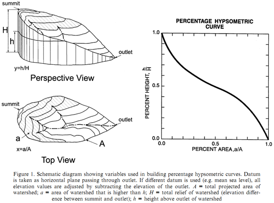
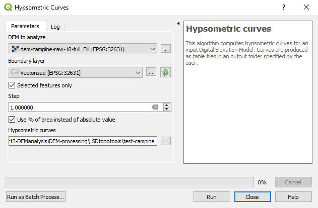
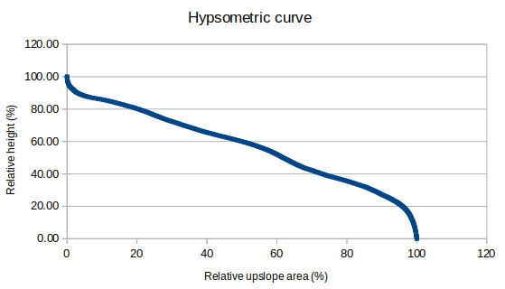

# Session 3 - Geomorphologic analyses

## Objectives of the day

1. Which topographic metrics are available in LSDTopoTools? ::: Read the LSDTopoTools documentation.
2. Which topographic metrics are available in QGIS? ::: Understand the concept of hypsometric curves.
3. Plan your work ::: Create a diagram using OneNote to provide details of your workflow.
4. What's next ? ::: Explore and run LSDTopoTools, select rivers of interest and produce results.

## Important note

Each time you connect to the server, you will need to load LSDTopoTools before running the first command. Simply type:

```bash
load_LSDTopoTools
```

-----

## Which topographic metrics are available in LSDTopoTools ?

Three modules of LSDTopoTools are useful for the analyses to achieve in the frame of the research project:

- The basic analysis ([resources](https://lsdtopotools.github.io/LSDTT_documentation/LSDTT_basic_usage.html)): `lsdtt-basic-metrics`
- The channel extraction ([resources](https://lsdtopotools.github.io/LSDTT_documentation/LSDTT_channel_extraction.html)): `lsdtt-channel-extraction`.
- The Chi analysis ([resources](https://lsdtopotools.github.io/LSDTT_documentation/LSDTT_chi_analysis.html); [related paper](https://esurf.copernicus.org/articles/6/505/2018/)): `lsdtt-chi-mapping`.

The manual for each module contains a lot of information... Focus *mainly* on "Appendix A" of each manual, which contains the parameters that are available, their explanation, and their potential to fulfill your needs. Each module works with a parameters file that has the same structure than the one you used for the first analysis of your study area. You *only* need to add or remove parameters in the fill and run it with the proper command.

## Which topographic metrics are available in QGIS ?

QGIS will enable you to visualise outputs from LSDTopoTools but also to run other topographic analyses. One mandatory analysis for the research project is to compute hypsometric curves. However, any other relevant analysis is welcome ! Be imaginative...

### Hypsometric curves

Following Strahler (1952), the hypsometric curve relates horizontal cross-sectional area of a drainage basin to relative elevation above basin mouth. As both parameters (in x and y) are dimensionless, curves can be described and compared irrespective of basin size or shape. In other words, it describes the relative proportion of the watershed area that lies at or above a given height relative to the total relief of the watershed (Luo, 1998). Differences in the shape of the curve are related to the degree of disequilibrium in the balance of erosive and tectonic forces (Weissel and Pratson, 1994).



**References**

- Luo, W. (1998). Hypsometric analysis with a geographic information system. *Computers & Geosciences*, *24*(8), 815-821.
- Strahler, A.N. (1952). Hypsometric (area-altitude) analysis of erosional topography. Geological Society of America Bulletin, 63, 1117-1142.
- Weissel, J.K., Pratson, L.F. (1994). The length-scaling properties of topography. Journal of Geophysical Research, 99, 13997-14012.

### To compute hypsometric curves in QGIS

In QGIS, use the *Hypsometric curves* toolbox available in the QGIS processing tools "Raster terrain analysis" (<u>not</u> "Hypsometry" from SAGA GIS).

1. Define the digital elevation model.
2. Define the "Boundary layer" parameter. It defines the limits of the river catchment of interest. It can be either a single polygon shapefile or a selected polygon in a multi-polygon shapefile. You can also loop on all the polygons of one given shapefile.
3. Importantly, define the "step" parameter. It defines the increment for the elevation, from the lowest to the highest point of the river catchment.
4. You can also consider to check the box "Use % of are instead of absolute value", in order to have a relative hypsometric curve and to allow comparison between catchments.

    

The output is a ``csv `` file, which contains the binned values for relative **downslope** catchment area and **absolute** elevation. You will therefore need to post-process the values to plot correct hypsometric curves.

- Relative height is computed by normalising height over its range, i.e. 
  $$
  (z - z_{min}) / (z_{max} - z_{min})
  $$

- Relative **upslope** area is computed as follows:
  $$
  100 - downslope\; area
  $$

- 

Visually, you should end up with something like: 



Here is the example file: [link](files/hypsometric-curves.ods)

## Plan your work

Write down a work plan / workflow (diagram with annotations, drawing, short text,...) of analyses required to fulfill the project. This work plan should detail each milestone to achieve the project and how everything connects to the final goal.

- What are the required outputs ?
- Which analyses ? For which purpose ? In which sequence ?
- Which parameters for which tool ? How to define them ?
- Which analysis on which software (LSDTopoTools / QGIS / Excel / R) ?
- Identify key references about concepts you do not understand well and include link / excerpts / figures / files.
- Note the spatial extent of the analysis: points along the river, points along a transect, catchment, ...
- Note the use of each analysis/result, in the frame of your research question.
- Note how you plan to combine/compare metrics to get additional knowledge.
- The more detailed is the workflow, the easiest it will be to perform the analyses.

Create your work plan in the related tab of your group channel on Microsoft Teams.

> The tab "Workflow" is a OneNote notebook that can be edited simultaneously by each member of the channel. You can create several notes, draw sketches, includes post-its, files, images...

Finalise the workflow on the OneNote tab of your group channel **before Tuesday 17th of November at 18:00**.

## What's next ?

1. Hands-on ! ::: Explore and run the modules of LSDTopoTools on your study area.
2. Focus your analysis ::: Select rivers to be further analysed.
3. Get your final results ::: Tune parameters, create and process results.
