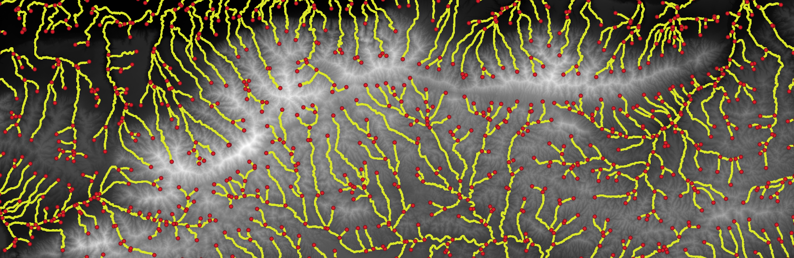

# Session 4 - Workflow

## Objectives of the day

If not already done, select rivers and catchments of interest and produce results using LSDTopotools and QGIS.

## Random topics

### Average using a moving window

Topographic data, as many other types of data, are noisy due to DEM creation and subsequent topographic derivatives. Therefore, it is often a good idea to smooth variables by averaging them using a moving window. The principle is very simple: replace a data point with the average of its neighbours, i.e. a window around the point ([source](http://www.statistics4u.info/fundstat_eng/cc_moving_average.html)).

*

The implementation of a moving window can simply be done either in Excel, R...

### Concavity and channel steepness indices

Some resources to better understand the theory about concavity, channel steepness and chi metrics:

- For a very brief overview, refer to the intro of the Chi module of LSDTopoTools: [Link](https://lsdtopotools.github.io/LSDTT_documentation/LSDTT_chi_analysis.html).
- The purpose of Chi plots, i.e. computing Chi instead of slope: [Perron and Royden (2013)](http://web.mit.edu/perron/www/files/PerronRoyden13.pdf).
- The two research papers behind the module of LSDTopoTools: [Mudd et al. (2014)](https://agupubs.onlinelibrary.wiley.com/doi/full/10.1002/2013JF002981) and [Mudd et al. (2018)](https://esurf.copernicus.org/articles/6/505/2018/esurf-6-505-2018.pdf).

## Workflow

Some functions and capabilities of the 3 modules of LSDTopoTools overlap with each other. You can indeed create the river network using the `lsdtt-chi-analysis` module for instance, whereas there is a specific `lsdtt-channel-extraction` module. It is partly due to the fact that advanced computations need the basic ones as inputs and partly due to the fact that you manipulate an open-source software that is incrementally built by researchers depending on their needs...

Do not forget the final goal of the project: to analyse river morphology and to highlight deviations from tectonic steady-state behaviour/shape. The morphology can be studied either along the longitudinal profile (line) or at the catchment scale (area). Independently of the processing time or the stability of a software with large datasets (e.g. QGIS for the Tros-Marets analysis), performing the same analysis on dozens of rivers would be time-consuming, especially when looking for morphometric patterns that could be visible in one part of your study area and not in another part; in one river but not in the adjacent rive. Focusing on an arbitrary set of rivers could lead to results that are actually not representative of the the tectonic setting of your study area... 

> I know that the sum of advanced concepts in tectonic geomorphology, server stuff and LSDTopoTools manipulations, is a massive amount of information to process at once! Here are some additional guidelines. Do not forget that you are in a group. Divide the workload and brainstorm as often as possible... Especially given the current setup with remote teaching/learning... 

### River catchment delineation

In order to analyse the spatial pattern of the tectonic signal in your study area, you will compare rivers and associated river catchments. Therefore, the first step is to extract river catchments. Of course, you will probably not be able to get the proper delineation that you would imagine based on topographic maps or your knowledge of the area. However, letting LSDTopoTools delineate catchments will speed up subsequent analyses. 

> The idea is to get catchments that are not too large, i.e. the comparison between catchments will be limited, but also not too small, i.e. the amount of catchments will complicate the comparison. Find a reasonable trade-off between precision and "maniability" of the data. 

To extract river catchments, you can use the `lsdtt-basic-metrics` module and tune the following parameters: 

```bash
# Getting the basins
find_basins: true
minimum_basin_size_pixels: 100000
maximum_basin_size_pixels: 400000
only_take_largest_basin: false
```


Here, we miss some small catchments draining to the North. Let's decrease the `minimum_basin_size_pixels` parameter...


If you want to divide the larger catchments to have a finer *resolution*, simply decrease the `maximum_basin_size_pixels` parameter...

### River network extraction

The river network can simply be extracted using the following parameter. It will provide a `.csv` file to spatialise in QGIS.

```bash
print_channels_to_csv: true
```

By default, it produces something like: 


As with the *Channel extraction* toolbox of QGIS, you can tune a parameter that represents the *amount of water* which is needed to *create* river sources:

```bash
threshold_contributing_pixels: 5000
```

> The idea is to have a channel network that does not account for high-order rivers. Again, think about maniability for further analyses. You will not delete unwanted streams by hand to discard 5th or 6th order rivers.


In addition, LSDTopoTools can create a `.csv` file containing the river junctions The latter can be useful to limit subsequent analyses to selected river junctions ([documentation](https://lsdtopotools.github.io/LSDTT_documentation/LSDTT_basic_usage.html#_picking_basins)): 

```bash
print_junctions_to_csv: true
```



### First Chi analysis and metrics for river points

Now that you have properly delineated the river network and associated catchments in your study area, the question is: which rivers will be selected for an in-depth analysis, i.e. transversal profiles, hypsometric curves... Of course, if you are very comfortable with automated geo-processing in QGIS, R or Python, you could perform the analysis on the entire set of delineated river catchments. However, developing advanced automated workflow for geoprocessing is out of scope in this research project... Therefore, you need to find a way to select catchments other than randomly. To do that, one method is to compute a basic version of the Chi value for every single point of the river network of the study area using the `lsdtt-basic-metrics` module with the following parameter:

```bash
print_chi_data_maps: true
```

You will end up with a `.csv` table that contains several useful information to produce graphs the first graphs for the entire study area and get the *big picture*...


Processing this table in Excel/R will enable you to produce longitudinal profiles along with Chi plots for the entire study. With that, you will be able to highlight rivers that are in equilibrium or not, patterns in rivers, groups of rivers... Example from [Perron and Royden (2013)](http://web.mit.edu/perron/www/files/PerronRoyden13.pdf):


### Catchment selection and further analyses

Based on longitudinal profiles and Chi plots, you are now able to select a set of relevant rivers for a in-depth analysis... As a reminder, analyses to produce are: 

- longitudinal profiles
- transversal profiles
- hypsometric curves
- slope vs drainage area plots
- channel steepness and concavity
- stream power indices.  

