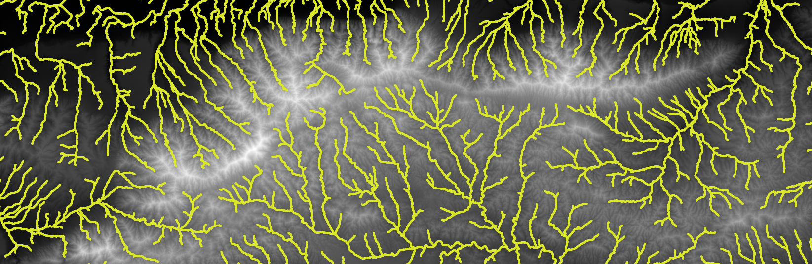
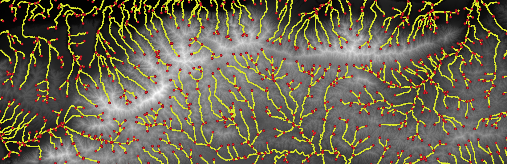
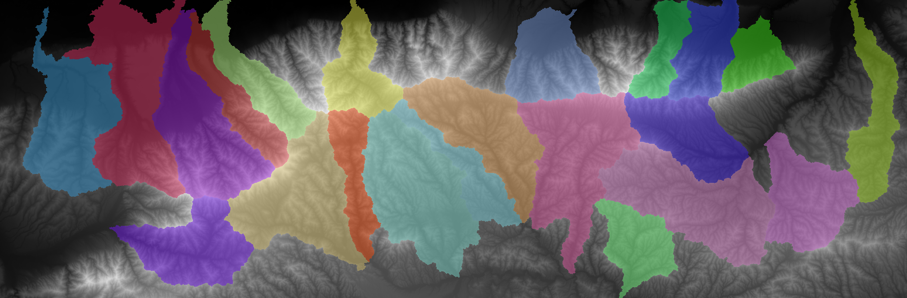
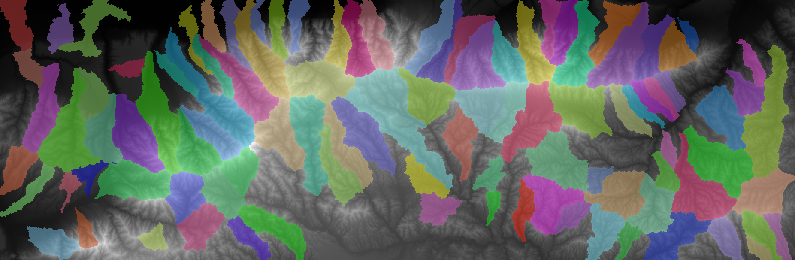
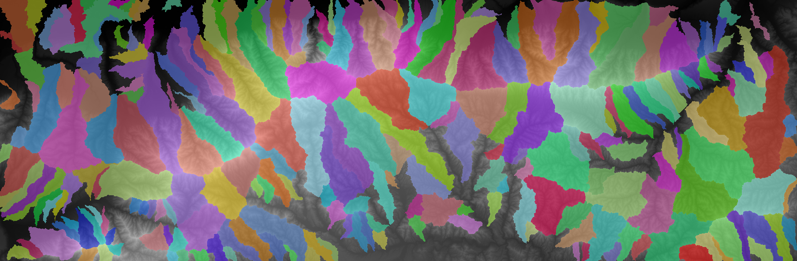
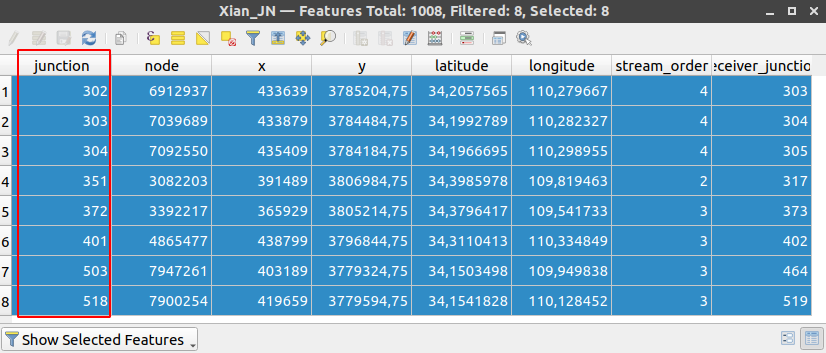
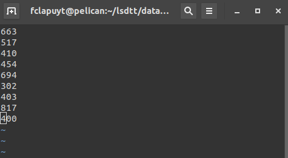
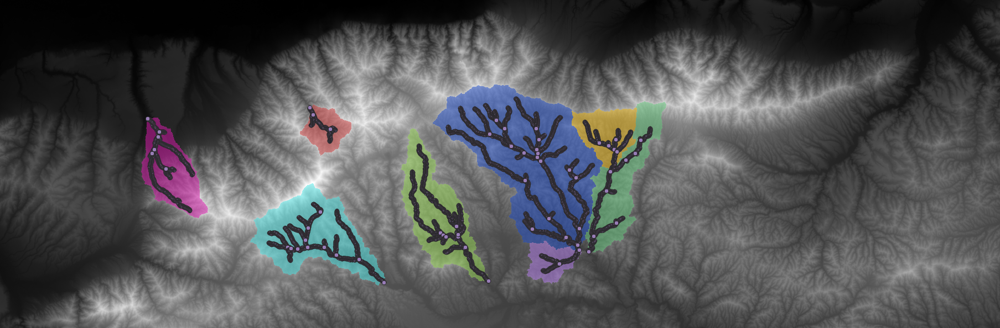
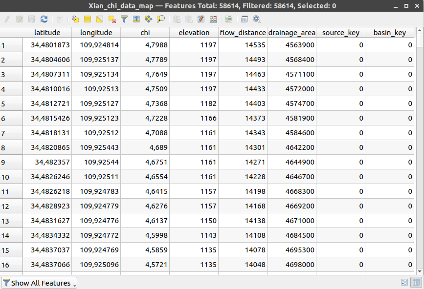
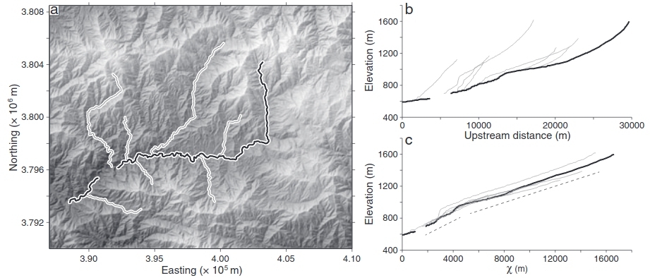

# What's next ?

Now, you are able to perform a basic topographic analysis on a very large amount of pixels in a very limited amount of time... Three modules of LSDTopoTools are useful for the analyses to achieve in the frame of the research project:

-   The basic analysis ([resources](https://lsdtopotools.github.io/LSDTT_documentation/LSDTT_basic_usage.html)): `lsdtt-basic-metrics`
-   The channel extraction ([resources](https://lsdtopotools.github.io/LSDTT_documentation/LSDTT_channel_extraction.html)): `lsdtt-channel-extraction`.
-   The Chi analysis ([resources](https://lsdtopotools.github.io/LSDTT_documentation/LSDTT_chi_analysis.html)): `lsdtt-chi-mapping`.

The manual for each module contains a lot of information... Focus *mainly* on "Appendix A" of each manual, which contains the parameters that are available, their explanation, and their potential to fulfill your needs. Each module works with a parameters file that has the same structure than the one you used for the first analysis of your study area. You *only* need to add or remove parameters in the fill and run it with the proper command.

------------------------------------------------------------------------

# Important note !

Each time you connect to the server, you will need to load LSDTopoTools before running the first command. Simply type:

``` bash
load_LSDTopoTools
```

------------------------------------------------------------------------


# Session 1/2 - Basic analyses 

## Objectives

1. Communicate with the server ::: Learn the basics of the shell usage.
2. Have a working infrastructure ::: Install LSDTopoTools.
3. Learn the logic of LSDTopoTools ::: Run an basic analysis on example data.
4. Compute first outputs for your study area ::: Create a proper parameter file that suits your needs.
5. Display your results in a GIS ::: Download LSDTT outputs and explore them in QGIS.
6. Qualitatively analyse your study area :::  Create a hillshaded DEM and inspect your study area. 
7. Which topographic metrics are available in LSDTopoTools? ::: Read the LSDTopoTools documentation.
8. Which topographic metrics are available in QGIS? ::: Understand the concept of hypsometric curves.
9. Plan your work ::: Create a diagram to provide details of your workflow.

## Workflow

### Technical setup

1. Set up your access to the server using a SSH client. [[resource](intro-server-and-ssh.md)] 
2. Learn basic shell commands [here](intro-shell.md).
3. Install LSDTopoTools and LSDMappingTools. [[resource](lsdtt-intro.md)]
4. Run the example topographic analysis to check whether everything is properly working, and understand the logic behind LSDTopoTools, i.e. parameters files and directory structure. [[resource](lsdtt-intro.md)]

### First topographic analysis

Run your first topographic analysis of your study area using LSDTopoTools [[resource](lsdtt-first-analysis.md)]. Download the outputs on your computer and explore all the data in QGIS... 

The raster outputs: 

| Filename         | Output                                                       |
| ---------------- | ------------------------------------------------------------ |
| `_Fill.bil`      | the filled DEM                                               |
| `_sh.bil`        | the hillshade                                                |
| `_d8_area.bil`   | the flow accumulation or drainage area, using the deterministic-8 method (in square meters) |
| `_FDIST.bil`     | the horizontal distance from the outlet along the river network (in meters) |
| `_SLOPE.bil`     | the slope on the non-filled DEM (as a gradient in m/m, i.e. dz / dx) |
| `_ASPECT.bil`    | the aspect (in degrees, from 0° to 360°)                     |
| `_CURV.bil`      | the curvature                                                |
| `_AllBasins.bil` | the selected river catchments (also used for basic Chi analysis) |

The table outputs, i.e. to be spatialised in QGIS as text-delimited layers (see QGIS tips):

| Filename            | Output                                                   |
| ------------------- | -------------------------------------------------------- |
| `_CN.csv`           | the channel network                                      |
| `_JN.csv`           | the junctions, i.e. river outlets of the channel network |
| `_chi_data_map.csv` | the basic chi computation for selected catchments        |

With these outputs, you are now able to compute a first graph of longitudinal profiles of the rivers in your study area. However, it will be poorly useful as too many river streams are extracted from the DEM. 

### Qualitative description of the study area

Computing hillshade and slope will help you to get a better visualisation of the topography. The two rasters are normally created during the previous step using the `lsdtt-basic-metrics` module of LSDTopoTools. Otherwise, you can generate these outputs using toolboxes in QGIS via the menu "Raster > Analysis".

The typical purpose of the hillshade it to create a 3D impression of your DEM. To do so, the hillshade should be superimposed to the DEM with a given transparency. To set the transparency in QGIS, choose the tab "Transparency" in the layer properties and adjust the value. 

Using the hillshaded DEM, you can do the following steps just by visual inspection :

- characterise the drainage river pattern (dentritic, parallel, rectangular), and changes throughout the landscape.
- highlight discontinuities in the drainage pattern, meandering behaviour, ...
- identify ridges, depressions, discontinuities in the topography.
- map human infrastructures that divert the course of the rivers.

In addition, draw transversal profiles to capture the global topography of the area, using the plugin "Profile tool" (see [random topics](random-topics.md)). Export outputs into text files and process them in Excel or R.

Eventually, you can confront your observations with literature and geological setting of your study area. 

### Plan your work

The use of LSDTopoTools might confusing and the learning curve a bit steep in the beginning...  The distinction between things that can be done in LSDTopoTools and in QGIS can be difficult too. In addition, some functions and capabilities of the 3 modules of LSDTopoTools overlap with each other. You can indeed create the river network using the `lsdtt-chi-analysis` module for instance, whereas there is a specific `lsdtt-channel-extraction` module. It is partly due to the fact that advanced computations need the basic ones as inputs and partly due to the fact that you manipulate an open-source software that is incrementally built by researchers depending on their needs... Therefore, before going further in the analysis, a mandatory step is to plan your work...

Write down a work plan / workflow (diagram with annotations, drawing, short text,...) of analyses required to fulfill the project. This work plan should detail each milestone to achieve the project and how everything connects to the final goal.

- What are the required outputs ?
- Which analyses ? For which purpose ? In which sequence ?
- Which parameters for which tool ? How to define them ?
- Which analysis on which software (LSDTopoTools / QGIS / Excel / R) ?
- Identify key references about concepts you do not understand well and include link / excerpts / figures / files.
- Note the spatial extent of the analysis: points along the river, points along a transect, catchment, ...
- Note the use of each analysis/result, in the frame of your research question.
- Note how you plan to combine/compare metrics to get additional knowledge.
- The more detailed is the workflow, the easiest it will be to perform the analyses.

Create your work plan in the related tab of your group channel on Microsoft Teams.

> The tab "Workflow" is a OneNote notebook that can be edited simultaneously by each member of the channel. You can create several notes, draw sketches, includes post-its, files, images...

-----

# Session 3 - Tune parameters

## Objectives

1. Create the river network ::: Tune parameters to derive the river network.
2. Focus your analysis ::: Select rivers and catchments to be further analysed.
4. Get your final results ::: Tune parameters, create and process results.

----

In order to analyse the spatial pattern of the tectonic signal in your study area, you will compare rivers and associated river catchments. Therefore, the first step is to extract the river network and catchments.

## River network extraction

In the first topographic analysis, two parameters are set to create the river network: 

```bash
print_channels_to_csv: true
threshold_contributing_pixels: 1000
```

The default value of contributing **pixels** to initiate rivers is set to 1000. By default, it produces something like: 


As with the *Channel extraction* toolbox of QGIS, you can tune this parameter that represents the *amount of water* which is needed to *create* river sources:

```bash
threshold_contributing_pixels: 5000
```

> The idea is to have a channel network that does not account for high-order rivers. Think about maniability of datasets for further analyses. You do not want delete unwanted streams by hand to discard very small first-order streams.



In addition, LSDTopoTools can create a `.csv` file containing the river junctions, i.e. `_JN.csv`.  The latter can be useful to limit subsequent analyses to selected river catchments ([documentation](https://lsdtopotools.github.io/LSDTT_documentation/LSDTT_basic_usage.html#_picking_basins)): 

```bash
print_junctions_to_csv: true
```



Perform a sensitivity analysis on the `threshold_contributing_pixels` parameter in order to derive a satisfying river network, which will be the basis for further analyses. 

## River catchment delineation

In topographic analysis, you will not only analyse rivers but also catchments, i.e. mainly for hypsometric curves and chi computation with LSDTopoTools. Two methods are available: (1) automatic delineation using minimum and maximum catchment areas or (2) manual delineation by selecting outlets of interest. 

### Automatic delineation

Using the automatic delineation will require a sensitivity analysis on minimum and maximum catchment area parameters, in order to produce a relevant subsequent analysis.

> The idea is to get catchments that are not too large, i.e. the comparison between catchments will be limited, but also not too small, i.e. the amount of catchments will complicate the comparison. Find a reasonable trade-off between precision and "maniability" of the data. 

To extract river catchments, you can use the `lsdtt-basic-metrics` module and tune the following parameters: 

```bash
# Getting the basins
find_basins: true
minimum_basin_size_pixels: 100000
maximum_basin_size_pixels: 400000
```



Here, we miss some small catchments, especially those draining to the North. Let's decrease the `minimum_basin_size_pixels` parameter...

```bash
# Getting the basins
find_basins: true
minimum_basin_size_pixels: 10000
maximum_basin_size_pixels: 400000
```


If you want to divide the larger catchments to have a finer *resolution*, simply decrease the `maximum_basin_size_pixels` parameter...

```bash
# Getting the basins
find_basins: true
minimum_basin_size_pixels: 10000
maximum_basin_size_pixels: 100000
```



Then, we miss the lower extents of catchments. We therefore need to decrease the `minimum_basin_size_pixels` again... 

```bash
# Getting the basins
find_basins: true
minimum_basin_size_pixels: 1000
maximum_basin_size_pixels: 100000
```



### Manual delineation

You can manually delineate river catchments by selecting junctions ([documentation](https://lsdtopotools.github.io/LSDTT_documentation/LSDTT_basic_usage.html#_picking_basins)). 

1. Spatialise the `_JN.csv` in QGIS.

2. In this layer, select points that you would like to consider as outlets for the selection of catchments.

3. Note the values of the `junction` column in the attribute table.

   

4. Create a text file, e.g. `junctions.txt`, which will contain the junction values, i.e. one number per line and upload it in the analysis folder on the server. 

   

5. In the parameters file of your LSDTopoTools analysis, add the following line to force the software to run analyses only on selected catchments. 

   ```bash
   BaselevelJunctions_file: junctions.txt
   ```

Once you ran the analysis using the `lsdtt-basic-metrics` module, you will get something like: 



## First Chi analysis and metrics for river points

Now that you have properly delineated the river network and associated catchments in your study area, the question is: which rivers will be selected for an in-depth analysis, i.e. transversal profiles, hypsometric curves... Of course, if you are very comfortable with automated geo-processing in QGIS, R or Python, you could perform the analysis on the entire set of delineated river catchments. However, developing advanced automated workflow for geoprocessing is out of scope in this research project... Therefore, you need to find a way to select catchments differently than randomly. To do that, one method is to compute a basic version of the Chi value for every single point of the river network for delineated catchments using the `lsdtt-basic-metrics` module with the following parameter:

```bash
print_chi_data_maps: true
```

You will end up with a `.csv` table that contains several useful information to produce graphs the first graphs for the entire study area and get the *big picture*...



The `basin_key` variable in the attribute table enables to categorise points by catchment. Using `chi` and `elevation` columns, you can compute basic Chi plots, as e.g. in Perroy and Royden (2013). 

Processing this table in Excel/R will enable you to produce longitudinal profiles along with Chi plots for the entire study. With that, you will be able to highlight rivers that are in equilibrium or not, patterns in rivers, groups of rivers... Example from [Perron and Royden (2013)](http://web.mit.edu/perron/www/files/PerronRoyden13.pdf):



----

# Session 4 - Compute results

Expected outputs for further discussion are: 

- longitudinal profiles
- transversal profiles
- hypsometric curves
- stream power indices.
- slope vs drainage area plots
- channel steepness and concavity

The simple method to compute steepness and concavity is to derive these metrics from the Slope-Area graphs. For an advanced and robust method to derive concavity for selected river catchments, refer to LSDTopoTools [documentation](https://lsdtopotools.github.io/LSDTT_documentation/LSDTT_chi_analysis.html).

