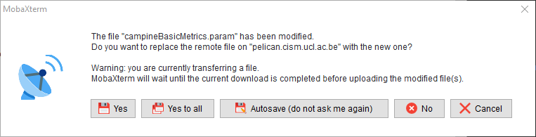

## MobaXterm tips and hints

When you download files from the server (**do not "Drag and drop"**):
  1. Select them manually.
  2. Right-click and select "Download".
  3. Choose a directory.

To paste a copied text line, simply right-click in the terminal window, where you would write the text line.

To visualise or edit text files from the server:
  1. In the file browser of MobaXterm software, double-click on the file. It will be opened in Notepad.
  2. View and/or edit it.
  3. Save the file and select "Yes" when the following screen appears. It will upload the modified file directly on the server.

